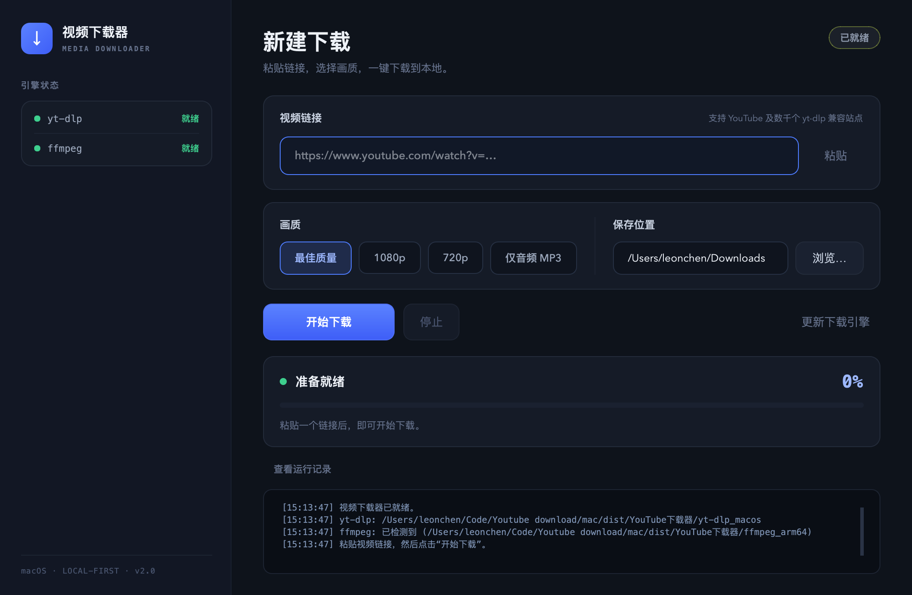

# YouTube Video Downloader

A desktop GUI for [yt-dlp](https://github.com/yt-dlp/yt-dlp), with separate launchers for Windows and macOS.



## Features

- Premium dark UI — card-based layout, gradient actions, live status states
- Paste a video URL and download with one click
- Choose best quality, 1080p, 720p, or MP3 audio
- See download progress, speed, and estimated time remaining
- Engine health at a glance (yt-dlp / ffmpeg readiness in the sidebar)
- Update the bundled download engine from the app
- Keep downloads and app settings on the local computer

## Project files

| Platform | Main file | Launch file |
| --- | --- | --- |
| macOS | `yt-dlp-gui.py` | `启动图形下载器.command` |
| Windows | `yt-dlp-gui.ps1` | `启动图形下载器.bat` |

## macOS quick start

1. Install Python 3 and PySide6: `python3 -m pip install pyside6`
2. Install yt-dlp: `brew install yt-dlp`
3. Optional, for merging video and audio streams: `brew install ffmpeg`
4. Double-click `启动图形下载器.command`.

## Windows quick start

1. Download `yt-dlp.exe` from the [official releases page](https://github.com/yt-dlp/yt-dlp/releases) and place it beside the PowerShell script.
2. Optionally add `ffmpeg.exe` for format merging.
3. Double-click `启动图形下载器.bat`.

## Repository layout

```
yt-dlp-gui.py        macOS GUI source        engines/   local yt-dlp / ffmpeg binaries
yt-dlp-gui.ps1       Windows GUI source      release/   built .app and distribution zips
build_app.sh         macOS packaging script  docs/      user manuals (CN)
```

## Repository notes

- `config.json` stores local preferences and is intentionally ignored by Git.
- Download engines, Python caches, temporary files, and `dist/` release artifacts are ignored.
- Use GitHub Releases for packaged application downloads instead of committing large binaries.

## Packaging (Windows)

A single-file `YouTube下载器.exe` (yt-dlp + ffmpeg bundled) is built in the cloud via GitHub Actions — no Windows machine needed:

```bash
gh workflow run build-windows.yml    # then download the artifact
```

## Packaging (macOS)

Build a standalone `YouTube视频下载器.app` that bundles the Python runtime, yt-dlp and ffmpeg — nothing needs to be installed on the target Mac (Apple Silicon):

```bash
python3 -m pip install pyside6 pyinstaller
./build_app.sh            # arm64; pass `x64` for an Intel build
```

Ship the zipped `.app` together with `打开方法.txt`, which walks the recipient through the first-launch Gatekeeper prompt.

## License

MIT
